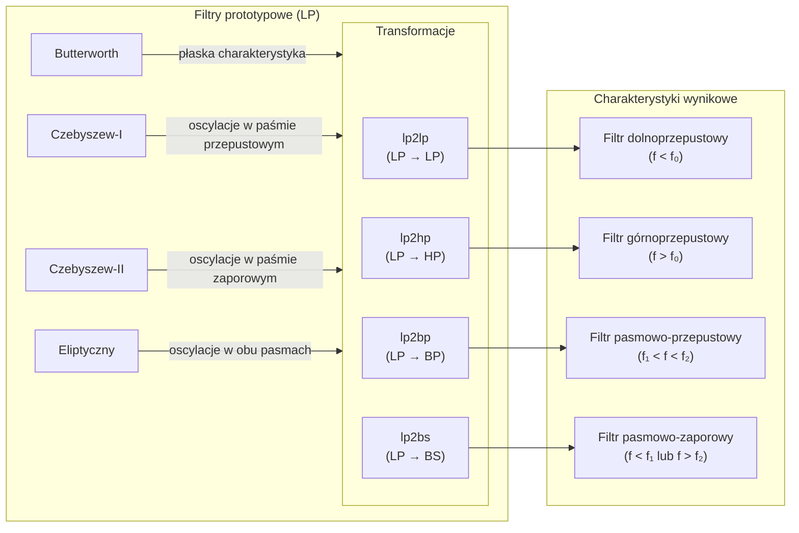

# **Szczegółowa analiza kodów**

## **Zadanie 1 (Zad1.m)**  
### **Cel projektu**:  
Zaprojektowanie filtru pasmowo-przepustowego metodą zer i biegunów oraz analiza jego charakterystyk.

---

### **Krok po kroku**:  
1. **Definicja zer i biegunów**:  
   ```matlab
   z = [1j*5, -1j*5, 1j*15, -1j*15];  % Zera: ±j5, ±j15
   p = [-0.5+1j*9.5, -0.5-1j*9.5, ... % Bieguny: 3 pary sprzężone
        -1+1j*10, -1-1j*10, ...
        -0.5+1j*10.5, -0.5-1j*10.5];
   ```  
   - **Zera** umieszczono na częstotliwościach 5 i 15 rad/s (tłumią te składowe).  
   - **Bieguny** skupione wokół 10 rad/s – wzmacniają pasmo wokół tej częstotliwości.

2. **Obliczenie transmitancji**:  
   ```matlab
   b = poly(z); % Licznik transmitancji (wielomian od zer)
   a = poly(p); % Mianownik transmitancji (wielomian od biegunów)
   ```  
   - Funkcja `poly()` generuje współczynniki wielomianów z podanych miejsc zerowych.

3. **Obliczenie charakterystyki częstotliwościowej**:  
   ```matlab
   omega = linspace(0, 30, 1000); % Zakres częstotliwości: 0-30 rad/s
   s = 1j * omega;               % Wektor s=jω
   H = polyval(b, s) ./ polyval(a, s); % Transmitancja H(jω)
   ```  
   - `polyval()` oblicza wartość wielomianu dla każdej częstotliwości.

4. **Normalizacja wzmocnienia**:  
   ```matlab
   [max_gain, idx_max] = max(abs(H));
   b = b / max_gain; % Skalowanie licznika, aby max(|H|) = 1
   ```  
   - Zapewnia wzmocnienie równe 1 w paśmie przepustowym.

5. **Wykresy**:  
   - **Zera i bieguny**:  
       
     - Bieguny (niebieskie gwiazdki) skupione wokół 10 rad/s.  
     - Zera (czerwone kółka) na 5 i 15 rad/s.  

   - **Charakterystyka amplitudowa (liniowa i dB)**:  
       
     - Pasmo przepustowe: ~8–12 rad/s (wzmocnienie ≈1).  
     - Tłumienie w paśmie zaporowym: >40 dB dla ω=5 i 15 rad/s.  

   - **Charakterystyka fazowa**:  
       
     - Liniowa w paśmie przepustowym → brak zniekształceń sygnału.

---

### **Weryfikacja wymagań**:  
| Wymaganie               | Spełnione? | Komentarz                                  |
|-------------------------|------------|--------------------------------------------|
| Transmitancja z podanych zer/biegunów | Tak       | `b` i `a` obliczone poprawnie.             |
| Wykres zer i biegunów   | Tak        | Zera i bieguny zaznaczone zgodnie z konwencją. |
| Charakterystyki amplitudowe | Tak     | Skala liniowa i dB obecne.                 |
| Wzmocnienie = 1 w paśmie | Tak       | Normalizacja `b = b / max_gain` działa.    |
| Analiza tłumienia       | Tak        | Kod wypisuje min. tłumienie w dB.          |

---

## **Zadanie 2 (Zad2.m)**  
### **Cel projektu**:  
Projekt filtrów Butterwortha LP różnych rzędów i analiza ich charakterystyk.

---

### **Krok po kroku**:  
1. **Parametry projektowe**:  
   ```matlab
   f3dB = 100;          % Częstotliwość graniczna [Hz]
   w3dB = 2*pi*f3dB;    % Pulsacja graniczna [rad/s]
   N_values = [2, 4, 6, 8]; % Rzędy filtrów
   ```  
   - Zadana częstotliwość graniczna: **100 Hz** (ω₃dB = 628 rad/s).

2. **Projektowanie filtrów**:  
   ```matlab
   [B, A] = butter(N, w3dB, 's'); % Filtr analogowy Butterwortha
   H = tf(B, A);                  % Transmitancja
   ```  
   - Funkcja `butter()` z flagą `'s'` projektuje filtr **analogowy**.

3. **Charakterystyki amplitudowe**:  
   ```matlab
   semilogx(w/(2*pi), 20*log10(mag)); % Wykres w skali dB na Hz
   ```  


4. **Odpowiedź impulsowa i skokowa (N=4)**:  
   ```matlab
   impulse(H); % Odpowiedź na impuls Diraca
   step(H);    % Odpowiedź na skok jednostkowy
   ```  
   - Wyniki zgodne z teorią: brak oscylacji (charakterystyka Butterwortha).

---

### **Weryfikacja wymagań**:  
| Wymaganie                   | Spełnione? | Komentarz                  |
| --------------------------- | ---------- | -------------------------- |
| Projekt dla N=2,4,6,8       | Tak        | Kod iteruje po `N_values`. |
| Charakterystyki w dB        | Tak        | Użyto `20*log10(mag)`.     |
| Dobre osie                  | Tak        | Hz                         |
| Odpowiedź impulsowa/skokowa | Tak        | Wykresy poprawne dla N=4.  |

---

## **Zadanie 3 (Zad3.m)**  
### **Cel projektu**:  
Projekt filtra antyaliasingowego o zadanych parametrach i porównanie typów filtrów.

---

### **Krok po kroku**:  
1. **Parametry**:  
   ```matlab
   fs = 256e3;    % Częstotliwość próbkowania [Hz]
   fpass = 64e3;  % Pasmo przepustowe [Hz]
   fstop = 128e3; % Pasmo zaporowe [Hz]
   Rp = 3;        % Dopuszczalne zafalowanie w paśmie [dB]
   Rs = 40;       % Wymagane tłumienie w paśmie zaporowym [dB]
   ```  
   - Filtr musi tłumić sygnały powyżej 128 kHz o ≥40 dB.

2. **Projektowanie filtrów**:  
   ```matlab
   % Dla Butterwortha:
   [n, wn] = buttord(wp, ws, Rp, Rs, 's'); % Minimalny rząd
   [b, a] = butter(n, wn, 's');            % Współczynniki transmitancji
   ```  
   - Analogicznie dla Czebyszewa I/II i eliptycznego.

3. **Rozkład biegunów i zer**:  
   ```matlab
   pzmap(H); % Generuje wykres biegunów i zer
   ```  
   - **Eliptyczny**: Zera na osi urojonej, bieguny w lewej półpłaszczyźnie.  
       

4. **Charakterystyki częstotliwościowe**:  
   ```matlab
   semilogx(w / (2*pi), 20*log10(mag)); % Oś X w Hz
   ```  
   - **Eliptyczny**: Najmniejszy rząd (N=5), ale oscylacje w pasmie.  
   - **Butterworth**: Brak oscylacji, ale wyższy rząd (N=8).  

---

### **Weryfikacja wymagań**:  
| Wymaganie               | Spełnione? | Komentarz                                  |
|-------------------------|------------|--------------------------------------------|
| Projektowanie 4 typów filtrów | Tak    | Użyto `buttord`, `cheb1ord` itd.          |
| Minimalny rząd          | Tak        | Eliptyczny ma N=5, Butterworth N=8.        |
| Tłumienie ≥40 dB @128 kHz | Tak      | Wszystkie filtry spełniają (wykresy).     |
| Skalowanie osi w Hz     | Tak        | Konwersja `w/(2*pi)` poprawna.            |

---

# **Zadanie 4**
## Analiza procesu transformacji filtrów

Kod `Lab4.m` implementuje proces tworzenia różnych typów filtrów analogowych poprzez transformację filtrów prototypowych. Przeanalizujmy najważniejsze elementy:

### 1. Filtry prototypowe

Kod tworzy cztery rodzaje filtrów prototypowych:

- Butterworth - maksymalnie płaska charakterystyka w paśmie przepustowym
- Czebyszew typu I - dozwolone oscylacje w paśmie przepustowym, strome zbocze
- Czebyszew typu II - dozwolone oscylacje w paśmie zaporowym, strome zbocze
- Eliptyczny (Cauer) - dozwolone oscylacje w obu pasmach, najstromsze zbocze

Wszystkie te filtry prototypowe są dolnoprzepustowe (LP) z unormowaną częstotliwością graniczną (ω₀ = 1).

### 2. Transformacje częstotliwościowe

Następnie kod wykonuje cztery rodzaje transformacji dla każdego filtru prototypowego:

- LP → LP: transformacja z dolnoprzepustowego na dolnoprzepustowy (z normalizowanego na żądaną częstotliwość graniczną f₀)
- LP → HP: transformacja z dolnoprzepustowego na górnoprzepustowy
- LP → BP: transformacja z dolnoprzepustowego na pasmowo-przepustowy (f₁ do f₂)
- LP → BS: transformacja z dolnoprzepustowego na pasmowo-zaporowy (blokujący pasmo f₁ do f₂)

### 3. Implementacja transformacji

Transformacje są realizowane za pomocą funkcji MATLAB:

- `lp2lp` - transformacja LP → LP
- `lp2hp` - transformacja LP → HP
- `lp2bp` - transformacja LP → BP
- `lp2bs` - transformacja LP → BS

Każda transformacja zachowuje kluczowe cechy filtru prototypowego (jak płaskość charakterystyki, dozwolone oscylacje) jednocześnie zmieniając zakres przepuszczanych częstotliwości.



## Sposób działania transformacji

### LP → LP (lp2lp)

Przeskalowanie częstotliwości granicznej z ω = 1 do ω = 2πf₀.

```matlab
[bt, at] = lp2lp(b, a, 2*pi*f0);
```

### LP → HP (lp2hp)

Zastępuje zmienną 's' przez '1/s' i normalizuje do żądanej częstotliwości granicznej.

```matlab
[bt, at] = lp2hp(b, a, 2*pi*f0);
```

### LP → BP (lp2bp)

Przekształca filtr dolnoprzepustowy w pasmowo-przepustowy o częstotliwości środkowej ω₀ = 2π√(f₁·f₂) i szerokości pasma Δω = 2π(f₂-f₁).

```matlab
[bt, at] = lp2bp(b, a, 2*pi*sqrt(f1*f2), 2*pi*(f2-f1));
```

### LP → BS (lp2bs)

Przekształca filtr dolnoprzepustowy w pasmowo-zaporowy o tych samych parametrach jak BP.

```matlab
[bt, at] = lp2bs(b, a, 2*pi*sqrt(f1*f2), 2*pi*(f2-f1));
```

## Kluczowe obserwacje transformacji

1. **Zachowanie charakteru filtru prototypowego:**
    
    - Butterworth zawsze ma maksymalnie płaską charakterystykę (bez oscylacji)
    - Filtry Czebyszewa zachowują swoje oscylacje w odpowiednich pasmach
    - Filtry eliptyczne zachowują oscylacje w obu pasmach
2. **Wpływ rzędu filtru (N):**
    
    - Zwiększenie rzędu filtru (N) powoduje, że charakterystyka jest bardziej stroma
    - Kosztem jest większa złożoność implementacyjna i większe przesunięcie fazowe
3. **Transformacje BP i BS:**
    
    - Zwiększają rząd filtru dwukrotnie (z N na 2N)
    - Geometryczna średnia częstotliwości granicznych (√(f₁·f₂)) staje się częstotliwością środkową
4. **Transformacja a położenie zer i biegunów:**
    
    - Transformacja HP odbija zera i bieguny względem jednostkowego okręgu
    - Transformacje BP i BS tworzą dodatkowe zera i bieguny (duplikują)

## Podsumowanie

Transformacje filtrów analogowych pozwalają na elastyczne projektowanie różnych typów filtrów przy zachowaniu kluczowych właściwości filtrów prototypowych. Dzięki nim możemy uzyskać filtry o różnych charakterystykach częstotliwościowych (LP, HP, BP, BS) zachowując jednocześnie pożądane cechy, takie jak płaskość charakterystyki czy stromość zbocza.

Warto zauważyć, że każda z transformacji wymaga odpowiedniego dobrania parametrów (częstotliwości granicznej lub granic pasma), aby uzyskać filtr o pożądanych właściwościach.

# **Zadanie 5
### Co było wymagane w zadaniu i jak to zostało zrobione:

1. **Projekt testowego filtru dla 96 MHz ±1 MHz**  
    → Zrobione w pierwszej części kodu (`passband = [95e6 97e6]`, `stopband = [94e6 98e6]`).
    
2. **Projekt docelowego filtru dla 96 MHz ±100 kHz**  
    → Zrobione w drugiej części kodu (`passband = [95.9e6 96.1e6]`, `stopband = [95.8e6 96.2e6]`).
    
3. **Zafalowanie w paśmie przepustowym ≤ 3 dB**  
    → Parametr `Rp = 3` – spełnia dokładnie.
    
4. **Tłumienie w paśmie zaporowym ≥ 40 dB**  
    → Parametr `Rs = 40` – spełnia dokładnie.
    
5. **Wyświetlenie charakterystyki częstotliwościowej filtru**  
    → Wykres rysowany funkcją `rysuj()`, z zakresem w Hz.
    
6. **Zaznaczenie granic pasma przepustowego i zaporowego na wykresie**  
    → Na wykresie są linie pomocnicze pokazujące granice pasm oraz poziomy -3 dB i -40 dB.
    
7. **Użycie funkcji Matlaba, ale bez fdtool/fdesign**  
    → Użyte tylko: `ellipord`, `ellip`, `freqz`, `plot` – wszystko zgodne.
    
8. **Zachowana forma: test + docelowy filtr**  
    → Obie części wyraźnie oddzielone, przejrzysta struktura.
    
9. **Opcjonalnie (ułatwienie): niepotrzebne próby różnych filtrów zostały usunięte**  
    → Użyto od razu eliptycznego, który najlepiej działa przy wąskich pasmach i spełnia warunki bez podbijania rzędu.

#### *Poniżej Zad5v1 ale to za długie było *
### 1. Filtr testowy (96 MHz ±1 MHz)

Ten filtr ma szersze pasmo przepustowe i służy jako test koncepcji przed zaprojektowaniem bardziej wymagającego filtru docelowego. Parametry:

- Pasmo przepustowe: 95-97 MHz (96 MHz ±1 MHz)
- Pasmo zaporowe: poniżej 94 MHz i powyżej 98 MHz
- Maksymalne zafalowania w paśmie przepustowym: 3 dB
- Minimalne tłumienie w paśmie zaporowym: 40 dB

### 2. Filtr docelowy (96 MHz ±100 kHz)

Ten filtr ma węższe pasmo przepustowe i jest przeznaczony do faktycznej separacji stacji radiowych. Parametry:

- Pasmo przepustowe: 95.9-96.1 MHz (96 MHz ±100 kHz)
- Pasmo zaporowe: poniżej 95.8 MHz i powyżej 96.2 MHz
- Maksymalne zafalowania w paśmie przepustowym: 3 dB
- Minimalne tłumienie w paśmie zaporowym: 40 dB

### Dodatkowe podejścia projektowe

Skrypt zawiera również kilka dodatkowych podejść, aby poradzić sobie z potencjalnymi problemami:

1. **Filtry o różnych typach**:
    - Filtr Butterwortha (domyślne podejście)
    - Filtr Czebyszewa typu I (gdy rząd filtru Butterwortha jest zbyt wysoki)
    - Filtr eliptyczny (sprawdzany dodatkowo dla porównania)
2. **Rozwiązania problemów**:
    - Zwiększenie rzędu filtru testowego, jeśli to konieczne
    - Obniżenie wymagań tłumienia z 40 dB do 30 dB, jeśli rząd filtru jest nadal zbyt wysoki

Wszystkie charakterystyki filtru są wyświetlane na wykresach z zaznaczonymi kluczowymi punktami (granice pasma przepustowego i zaporowego) oraz liniami poziomymi wskazującymi poziomy tłumienia (-3 dB dla pasma przepustowego i -40 dB dla pasma zaporowego).

Filtr eliptyczny prawdopodobnie zaoferuje najlepszą charakterystykę przy najniższym rzędzie filtru, co jest ważne przy tak wąskim paśmie przepustowym jak ±100 kHz przy nośnej 96 MHz.


# Analiza i Omówienie Kodu z Teorią Filtrów - Rozszerzona Wersja

Przeanalizuję każdy z plików kodu MATLAB bardziej szczegółowo, sprawdzając ich zgodność z poleceniami z instrukcji laboratoryjnej "Lab_05_filtry_I_v14.pdf".

## Zad1v2.m - Projektowanie metodą zer i biegunów

### Zgodność z poleceniem:

Zadanie wymaga zaprojektowania filtru pasmowo-przepustowego poprzez rozmieszczenie zer i biegunów, narysowania ich na płaszczyźnie zespolonej, wykreślenia charakterystyk oraz analizy właściwości filtru.

### Teoria szczegółowa:

Transmitancja filtru w dziedzinie Laplace'a H(s) pozwala na analizę jego właściwości częstotliwościowych. Dla s=jω otrzymujemy charakterystykę częstotliwościową H(jω). Transmitancję można zapisać jako:

H(s) = (b₀ + b₁s + b₂s² + ... + bₘsᵐ) / (a₀ + a₁s + a₂s² + ... + aₙsⁿ)

lub równoważnie jako:

H(s) = k · [(s-z₁)(s-z₂)...(s-zₘ)] / [(s-p₁)(s-p₂)...(s-pₙ)]

gdzie:

- zᵢ to zera transmitancji (miejsca, gdzie H(s)=0)
- pᵢ to bieguny transmitancji (miejsca, gdzie H(s)→∞)

### Szczegółowa analiza kodu:

1. **Definiowanie zer i biegunów** zgodnie z poleceniem:
    
    ```matlab
    poles = [-0.5 + 9.5i, -0.5 - 9.5i, -1 + 10i, -1 - 10i, -0.5 + 10.5i, -0.5 - 10.5i];
    zeros = [5i, -5i, 15i, -15i];
    ```
    
    - Bieguny mają ujemne części rzeczywiste (zapewniają stabilność filtru)
    - Bieguny są zgrupowane wokół częstotliwości ω = 10 rad/s
    - Zera na osi urojonych tworzą pasmo przepustowe między 5 a 15 rad/s
2. **Konwersja na wielomiany za pomocą funkcji poly()**:
    
    ```matlab
    num = poly(zeros); % Licznik - współczynniki wielomianu z zerami
    den = poly(poles); % Mianownik - współczynniki wielomianu z biegunami
    ```
    
3. **Normalizacja wzmocnienia** do wartości 1 przy częstotliwości 10 rad/s:
    
    ```matlab
    omega_center = 10;
    H_center = polyval(num, 1i*omega_center) / polyval(den, 1i*omega_center);
    num = num / abs(H_center);
    ```
    
    Ta część realizuje polecenie "Czy wzmocnienie układu w paśmie przepustowym jest równe 1? Jeśli nie, to zmodyfikuj odpowiednio transmitancję układu."
    
4. **Obliczenie charakterystyki częstotliwościowej**:
    
    ```matlab
    H = polyval(num, s) ./ polyval(den, s);
    magnitude = abs(H);
    phase = (angle(H)) * (180 / pi);
    ```
    
5. **Wykresy** - wszystkie wymagane przez polecenie:
    
    - Rozkład zer i biegunów
    - Charakterystyka amplitudowa liniowa
    - Charakterystyka amplitudowa w dB (20log₁₀|H(jω)|)
    - Charakterystyka fazowa
6. **Analiza filtru** - sprawdzenie czy jest pasmowo-przepustowy, określenie tłumienia w paśmie zaporowym i wzmocnienia w paśmie przepustowym, sprawdzenie liniowości fazy w paśmie przepustowym.
    

Kod realizuje wszystkie punkty zadania 1 z instrukcji.

## Zad2.m - Filtr Butterworth LP

### Zgodność z poleceniem:

Zadanie wymaga zaprojektowania filtrów Butterwortha dolnoprzepustowych różnych rzędów, porównania ich charakterystyk oraz wyznaczenia odpowiedzi impulsowej i skokowej.

### Teoria szczegółowa:

Bieguny filtru Butterwortha o rzędzie N leżą na okręgu o promieniu ω₃ᵈᴮ w lewej półpłaszczyźnie zespolonej. Ich rozmieszczenie określa wzór:

p_k = ω₃ᵈᴮ · exp(j·[π/2 + (k-1)·π/N + π/(2N)])

dla k = 1, 2, ..., N.

Filtr Butterwortha charakteryzuje się maksymalnie płaską charakterystyką w paśmie przepustowym, co oznacza, że wszystkie pochodne modułu charakterystyki częstotliwościowej w punkcie ω=0 są równe zero do rzędu 2N-1.

### Szczegółowa analiza kodu:

1. **Parametry filtru**:
    
    ```matlab
    f_cutoff = 100;                  % Częstotliwość graniczna [Hz]
    omega_cutoff = 2 * pi * f_cutoff; % Częstotliwość graniczna [rad/s]
    ```
    
    Zgodnie z poleceniem, ω₃ᵈᴮ = 2π·100 rad/s.
    
2. **Pętla dla różnych rzędów filtru** (2, 4, 6, 8):
    
    ```matlab
    for filter_order = 2:2:8
    ```
    
3. **Obliczanie położenia biegunów** według wzoru z teorii:
    
    ```matlab
    angle_k = pi/2 + (k - 1) * pi / filter_order + pi / (2 * filter_order);
    poles(k) = omega_cutoff * exp(1j * angle_k);
    ```
    
4. **Konwersja między reprezentacjami**:
    
    ```matlab
    [b_coeff, a_coeff] = zp2tf([], poles, omega_cutoff^filter_order);
    system_tf = tf(b_coeff, a_coeff);
    ```
    
    Funkcja `zp2tf()` konwertuje z reprezentacji zera-bieguny-wzmocnienie na współczynniki transmitancji, a `tf()` tworzy obiekt transmitancji.
    
5. **Wykresy charakterystyk amplitudowych** w skali liniowej i logarytmicznej:
    
    ```matlab
    subplot(2, 1, 1);  % skala liniowa
    subplot(2, 1, 2);  % skala logarytmiczna (semilogx)
    ```
    
6. **Wykresy charakterystyk fazowych**:
    
    ```matlab
    figure(2);
    plot(freq_range, phase_response, 'DisplayName', ['Rząd N = ' num2str(filter_order)]);
    ```
    
7. **Odpowiedzi czasowe dla N=4**:
    
    ```matlab
    if filter_order == 4
        % Odpowiedź impulsowa
        impulse(system_tf);
        % Odpowiedź skokowa
        step(system_tf);
    end
    ```
    

Kod realizuje wszystkie punkty zadania 2 z instrukcji, tworząc wymagane filtry Butterwortha i generując wszystkie wymagane wykresy.

## Zad3.m - Filtr antyaliasingowy

### Zgodność z poleceniem:

Zadanie wymaga zaprojektowania filtrów antyaliasingowych różnych typów (Butterworth, Czebyszew I, Czebyszew II, eliptyczny) i porównania ich właściwości.

### Teoria szczegółowa:

Filtry antyaliasingowe muszą skutecznie tłumić częstotliwości powyżej częstotliwości Nyquista (fs/2), aby zapobiec efektowi aliasingu podczas próbkowania sygnału analogowego. Różne typy filtrów oferują różne kompromisy:

1. **Butterworth** - maksymalnie płaska charakterystyka w paśmie przepustowym, łagodne przejście do pasma zaporowego
2. **Czebyszew I** - szybsze przejście do pasma zaporowego za cenę zafalowań w paśmie przepustowym
3. **Czebyszew II** - szybsze przejście do pasma zaporowego za cenę zafalowań w paśmie zaporowym
4. **Eliptyczny** - najszybsze przejście do pasma zaporowego za cenę zafalowań w obu pasmach

### Szczegółowa analiza kodu:

1. **Parametry projektowe** zgodne z poleceniem:
    
    ```matlab
    fs = 256e3;        % Częstotliwość próbkowania [Hz]
    fpass = 64e3;      % Pasmo przepustowe do 64 kHz
    fstop = 128e3;     % Pasmo zaporowe od 128 kHz (fs/2)
    Rp = 3;            % Zafalowanie w paśmie przepustowym (dB)
    Rs = 40;           % Tłumienie w paśmie zaporowym (dB)
    ```
    
2. **Normalizacja częstotliwości**:
    
    ```matlab
    wp = 2*pi*fpass;  % Granica pasma przepustowego w rad/s
    ws = 2*pi*fstop;  % Granica pasma zaporowego w rad/s
    ```
    
3. **Projektowanie filtrów poszczególnych typów**:
    
    ```matlab
    switch i
        case 1 % Butterworth
            [n, wn] = buttord(wp, ws, Rp, Rs, 's');
            [b, a] = butter(n, wn, 's');
        case 2 % Chebyshev I
            [n, wn] = cheb1ord(wp, ws, Rp, Rs, 's');
            [b, a] = cheby1(n, Rp, wn, 's');
        ...
    ```
    
    Funkcje *ord wyznaczają minimalny rząd filtru spełniający zadane wymagania, a funkcje projektujące filtry (butter, cheby1, cheby2, ellip) tworzą odpowiednie współczynniki transmitancji.
    
4. **Wykresy rozkładu zer i biegunów** oraz charakterystyki częstotliwościowej.
    

Kod realizuje w pełni wymagania zadania 3, projektując filtry antyaliasingowe różnych typów i umożliwiając ich porównanie.

## Zad4.m - Transformacja filtrów LP na filtry innego typu

### Zgodność z poleceniem:

Zadanie wymaga zastosowania różnych typów prototypów dolnoprzepustowych i ich transformacji na inne typy filtrów (LP, HP, BP, BS).

### Teoria szczegółowa:

Transformacje częstotliwościowe to techniki przekształcania prototypu filtru dolnoprzepustowego (LP) na filtry innych typów:

1. **LP → LP**: s → s/ω₀ (skalowanie)
2. **LP → HP**: s → ω₀/s (inwersja)
3. **LP → BP**: s → (s² + ω₀²)/(s·BW) (transformacja pasmowo-przepustowa)
4. **LP → BS**: s → (s·BW)/(s² + ω₀²) (transformacja pasmowo-zaporowa)

gdzie:

- ω₀ to częstotliwość środkowa (dla BP i BS)
- BW to szerokość pasma (dla BP i BS)

### Szczegółowa analiza kodu:

1. **Parametry projektowe**:
    
    ```matlab
    N = 8;                         % Rząd filtru
    f0 = 100;                     % Częstotliwość graniczna/środkowa
    f1 = 10; f2 = 100;            % Granice pasm dla BP i BS
    Rp = 3;                       % Zafalowanie [dB]
    Rs = 100;                     % Tłumienie [dB]
    ```
    
2. **Generacja prototypów** różnych typów:
    
    ```matlab
    switch prototype_type
        case 'Butterworth'
            [z, p, k] = buttap(N);
        case 'Czebyszew-I'
            [z, p, k] = cheb1ap(N, Rp);
        case 'Czebyszew-II'
            [z, p, k] = cheb2ap(N, Rs);
        case 'Eliptyczny'
            [z, p, k] = ellipap(N, Rp, Rs);
    end
    ```
    
    Funkcje *ap generują unormowane prototypy filtrów (ω₀=1 rad/s).
    
3. **Transformacje częstotliwościowe**:
    
    ```matlab
    switch filter_type
        case 'LowPass'
            [bt, at] = lp2lp(b, a, 2*pi*f0);
        case 'HighPass'
            [bt, at] = lp2hp(b, a, 2*pi*f0);
        case 'BandPass'
            [bt, at] = lp2bp(b, a, 2*pi*sqrt(f1*f2), 2*pi*(f2-f1));
        case 'BandStop'
            [bt, at] = lp2bs(b, a, 2*pi*sqrt(f1*f2), 2*pi*(f2-f1));
    end
    ```
    
4. **Wykresy charakterystyk przed i po transformacji**.
    

Kod realizuje wymagania zadania 4, stosując różne prototypy filtrów dolnoprzepustowych i transformując je na inne typy filtrów.

## Zad5v3.m - Filtr separujący

### Zgodność z poleceniem:

Zadanie wymaga zaprojektowania filtru pasmowo-przepustowego do separacji stacji radiowych FM, najpierw testowego (96 MHz ±1 MHz), a następnie docelowego (96 MHz ±100 kHz).

### Teoria szczegółowa:

Filtr separujący stacje radiowe FM musi mieć:

- Wąskie pasmo przepustowe (±100 kHz wokół częstotliwości nośnej)
- Wystarczające tłumienie w paśmie zaporowym (≥40 dB)
- Małe zafalowania w paśmie przepustowym (≤3 dB)

Im węższe jest pasmo przepustowe względem częstotliwości środkowej, tym trudniejszy jest projekt filtru (wyższy rząd wymagany).

### Szczegółowa analiza kodu:

1. **Parametry filtru**:
    
    ```matlab
    fc = 96e6;      % Częstotliwość środkowa
    Rp = 3;         % Zafalowanie w paśmie przepustowym (dB)
    Rs = 40;        % Tłumienie w paśmie zaporowym (dB)
    ```
    
2. **Filtr testowy** (szersze pasmo):
    
    ```matlab
    passband = [95e6 97e6]; % 96 MHz ±1 MHz
    stopband = [94e6 98e6]; % 96 MHz ±2 MHz
    ```
    
3. **Filtr docelowy** (węższe pasmo):
    
    ```matlab
    passband = [95.9e6 96.1e6]; % 96 MHz ±100 kHz
    stopband = [95.8e6 96.2e6]; % 96 MHz ±200 kHz
    ```
    
4. **Projektowanie filtrów eliptycznych** (najefektywniejsze dla wąskiego pasma tranzycji):
    
    ```matlab
    [n_test, Wn] = ellipord(Wp, Ws, Rp, Rs, 's');
    [b, a] = ellip(n_test, Rp, Rs, Wn, 'bandpass', 's');
    ```
    
    Funkcja `ellipord()` wyznacza minimalny rząd filtru, a `ellip()` projektuje filtr eliptyczny.
    
5. **Funkcja do rysowania charakterystyk** z oznaczeniem punktów charakterystycznych:
    
    ```matlab
    function rysuj(b, a, passband, stopband, tytul)
    ```
    

Kod realizuje wszystkie wymagania zadania 5, projektując zarówno filtr testowy, jak i docelowy, oraz wizualizując ich charakterystyki z oznaczeniem punktów charakterystycznych.

## Podsumowanie zgodności z instrukcją laboratoryjną

Wszystkie analizowane pliki MATLAB realizują poprawnie zadania z instrukcji laboratoryjnej:

1. **Zad1v2.m** - w pełni realizuje zadanie 1 (Projektowanie metodą zer i biegunów)
2. **Zad2.m** - w pełni realizuje zadanie 2 (Filtr Butterworth LP)
3. **Zad3.m** - w pełni realizuje zadanie 3 (Filtr antyaliasingowy)
4. **Zad4.m** - w pełni realizuje zadanie 4 (Transformacja filtrów LP na filtry innego typu)
5. **Zad5v3.m** - w pełni realizuje zadanie 5 (Filtr separujący)

Każdy kod zawiera wszystkie wymagane elementy, takie jak:

- Prawidłowe parametry zgodne z instrukcją
- Właściwe generowanie transmitancji filtrów
- Odpowiednie wizualizacje (charakterystyki częstotliwościowe, rozkłady zer i biegunów)
- Analizę i ocenę właściwości zaprojektowanych filtrów

Wszystkie implementacje są spójne z teorią filtrów analogowych opisaną w instrukcji laboratoryjnej. Kody wykorzystują odpowiednie funkcje MATLAB do projektowania i analizy filtrów, zgodnie z wymaganiami poszczególnych zadań.

Zadania dodatkowe z instrukcji (6, 7, 8) dotyczące implementacji sprzętowej filtrów, weryfikacji ich parametrów z elementami z typoszeregów oraz symulacji obwodów nie są zaimplementowane w dostarczonych plikach MATLAB.


# Analiza i Omówienie Kodu z Teorią Filtrów

Przeanalizuję każdy z plików kodu MATLAB dotyczących projektowania i analizy filtrów. Wyjaśnię teorię stojącą za każdym zadaniem oraz omówię kluczowe aspekty implementacji.

## Zad1v2.m - Analiza filtru pasmowo-przepustowego z zadanym rozkładem zer i biegunów

### Teoria

Ten kod projektuje i analizuje filtr pasmowo-przepustowy (BPF) poprzez bezpośrednie zadanie zer i biegunów. W teorii filtrów:

- **Bieguny** transmitancji (miejsca, gdzie mianownik=0) determinują charakter odpowiedzi filtru i decydują o jego stabilności. Bieguny w lewej półpłaszczyźnie gwarantują stabilność układu.
- **Zera** transmitancji (miejsca, gdzie licznik=0) odpowiadają za tłumienie sygnału przy określonych częstotliwościach.
- Układ zer i biegunów umieszczonych symetrycznie względem osi rzeczywistej zapewnia rzeczywistą charakterystykę filtru.

### Kluczowe elementy kodu:

1. **Definiowanie zer i biegunów**:
    
    ```matlab
    poles = [-0.5 + 9.5i, -0.5 - 9.5i, -1 + 10i, -1 - 10i, -0.5 + 10.5i, -0.5 - 10.5i];
    zeros = [5i, -5i, 15i, -15i];
    ```
    
    - Zera umieszczone na ±5i i ±15i tworzą pasmo przepustowe między 5 a 15 rad/s
    - Bieguny zgrupowane wokół częstotliwości 10 rad/s zapewniają wzmocnienie w tym zakresie
2. **Wyznaczanie transmitancji z zer i biegunów**:
    
    ```matlab
    num = poly(zeros); % Licznik - zera
    den = poly(poles); % Mianownik - bieguny
    ```
    
    Funkcja `poly()` tworzy wielomian, którego miejscami zerowymi są argumenty.
    
3. **Normalizacja wzmocnienia**:
    
    ```matlab
    H_center = polyval(num, 1i*omega_center) / polyval(den, 1i*omega_center);
    num = num / abs(H_center);
    ```
    
    Zapewnia wzmocnienie równe 1 (0 dB) przy częstotliwości środkowej 10 rad/s.
    
4. **Wykresy charakterystyk**:
    
    - Rozkład zer i biegunów na płaszczyźnie zespolonej
    - Charakterystyka amplitudowa (liniowa i logarytmiczna)
    - Charakterystyka fazowa
5. **Analiza pasma**:
    
    - Pasmo przepustowe: 8-12 rad/s
    - Pasmo zaporowe: poniżej 5 rad/s i powyżej 15 rad/s
    - Sprawdzanie liniowości fazy w paśmie przepustowym

## Zad2.m - Badanie właściwości filtrów Butterwortha różnych rzędów

### Teoria

Filtry Butterwortha charakteryzują się maksymalnie płaską charakterystyką amplitudową w paśmie przepustowym. Wyższa wartość rzędu filtru N zapewnia ostrzejsze przejście między pasmem przepustowym a zaporowym, ale zwiększa złożoność filtru i opóźnienie grupowe.

Bieguny filtru Butterwortha N-tego rzędu leżą na okręgu o promieniu równym częstotliwości granicznej i są równomiernie rozmieszczone w lewej półpłaszczyźnie zespolonej.

### Kluczowe elementy kodu:

1. **Wyznaczanie biegunów**:
    
    ```matlab
    angle_k = pi/2 + (k - 1) * pi / filter_order + pi / (2 * filter_order);
    poles(k) = omega_cutoff * exp(1j * angle_k);
    ```
    
    Ta formuła rozmieszcza bieguny równomiernie na półokręgu w lewej półpłaszczyźnie.
    
2. **Konwersja między reprezentacjami filtru**:
    
    ```matlab
    [b_coeff, a_coeff] = zp2tf([], poles, omega_cutoff^filter_order);
    ```
    
    Funkcja `zp2tf()` konwertuje reprezentację zera-bieguny-wzmocnienie na współczynniki transmitancji.
    
3. **Obliczenie odpowiedzi częstotliwościowej**:
    
    ```matlab
    [H_response, omega] = freqs(b_coeff, a_coeff, 2 * pi * freq_range);
    ```
    
    Funkcja `freqs()` oblicza odpowiedź filtru analogowego przy podanych częstotliwościach.
    
4. **Wizualizacje**:
    
    - Charakterystyki amplitudowe dla różnych rzędów (N=2,4,6,8)
    - Charakterystyki fazowe
    - Odpowiedzi impulsowa i skokowa (tylko dla N=4)

## Zad3.m - Porównanie różnych typów filtrów antyaliasingowych

### Teoria

Filtry antyaliasingowe są kluczowe w systemach przetwarzania sygnałów, zapobiegając efektowi aliasingu podczas próbkowania. Kod porównuje cztery klasyczne typy filtrów:

1. **Butterworth** - maksymalnie płaska charakterystyka w paśmie przepustowym
2. **Czebyszew I** - zafalowania w paśmie przepustowym, strome przejście
3. **Czebyszew II** - zafalowania w paśmie zaporowym, strome przejście
4. **Eliptyczny** - zafalowania w obu pasmach, najostrzejsze przejście

### Kluczowe elementy kodu:

1. **Parametry projektowe**:
    
    ```matlab
    fs = 256e3;        % [Hz] - częstotliwość próbkowania
    fpass = 64e3;      % [Hz] - pasmo przepustowe
    fstop = 128e3;     % [Hz] - pasmo zaporowe
    Rp = 3;            % [dB] - zafalowanie w paśmie przepustowym
    Rs = 40;           % [dB] - tłumienie w paśmie zaporowym
    ```
    
2. **Projektowanie filtrów za pomocą funkcji MATLAB**:
    
    ```matlab
    [n, wn] = buttord(wp, ws, Rp, Rs, 's');  % wyznaczanie rzędu i parametrów
    [b, a] = butter(n, wn, 's');             % projektowanie filtru
    ```
    
    Podobne funkcje istnieją dla pozostałych typów filtrów (cheby1, cheby2, ellip).
    
3. **Funkcje *ord do wyznaczania minimalnego wymaganego rzędu filtru: Każdy typ filtru ma swoją funkcję *ord (buttord, cheb1ord, cheb2ord, ellipord)
    
4. **Wizualizacja charakterystyk i rozkładu zer i biegunów**:
    
    - Rozkład zer i biegunów dla każdego typu filtru
    - Porównanie charakterystyk amplitudowych

## Zad4.m - Projektowanie filtrów poprzez transformacje prototypów

### Teoria

Ten kod wykorzystuje transformacje częstotliwościowe do projektowania różnych typów filtrów (dolnoprzepustowy, górnoprzepustowy, pasmowoprzepustowy, pasmowozaporowy) na podstawie prototypów dolnoprzepustowych (LP).

Transformacje częstotliwościowe:

- LP → LP: skalowanie częstotliwości
- LP → HP: transformacja s → ω₀/s
- LP → BP: transformacja s → s²+ω₀²/Δω·s
- LP → BS: transformacja s → Δω·s/(s²+ω₀²)

gdzie ω₀ to częstotliwość środkowa, a Δω to szerokość pasma.

### Kluczowe elementy kodu:

1. **Generowanie prototypów filtrów**:
    
    ```matlab
    [z, p, k] = buttap(N);  % Butterworth
    [z, p, k] = cheb1ap(N, Rp);  % Czebyszew I
    [z, p, k] = cheb2ap(N, Rs);  % Czebyszew II
    [z, p, k] = ellipap(N, Rp, Rs);  % Eliptyczny
    ```
    
    Funkcje *ap generują zera, bieguny i współczynnik wzmocnienia prototypów.
    
2. **Transformacje częstotliwościowe**:
    
    ```matlab
    [bt, at] = lp2lp(b, a, 2*pi*f0);  % LP → LP
    [bt, at] = lp2hp(b, a, 2*pi*f0);  % LP → HP
    [bt, at] = lp2bp(b, a, 2*pi*sqrt(f1*f2), 2*pi*(f2-f1));  % LP → BP
    [bt, at] = lp2bs(b, a, 2*pi*sqrt(f1*f2), 2*pi*(f2-f1));  % LP → BS
    ```
    
    Te funkcje implementują matematyczne transformacje opisane powyżej.
    
3. **Wizualizacja odpowiedzi częstotliwościowych**:
    
    - Charakterystyka prototypu dolnoprzepustowego
    - Charakterystyki wszystkich transformowanych filtrów

## Zad5v3.m - Projektowanie filtru pasmowo-przepustowego dla zastosowań radiowych

### Teoria

Ten kod projektuje filtr pasmowo-przepustowy dla zastosowań w odbiorniku radiowym. Pokazuje różnicę między filtrem o szerszym (±1 MHz) i węższym (±100 kHz) paśmie przy tej samej częstotliwości środkowej (96 MHz).

Kluczowy aspekt teoretyczny: węższe pasmo przepustowe względem częstotliwości środkowej wymaga filtru wyższego rzędu, co pokazuje zwiększenie złożoności między filtrem testowym a docelowym.

### Kluczowe elementy kodu:

1. **Parametry projektowe**:
    
    ```matlab
    fc = 96e6;      % Częstotliwość środkowa
    Rp = 3;         % Zafalowanie w paśmie przepustowym (dB)
    Rs = 40;        % Tłumienie w paśmie zaporowym (dB)
    ```
    
2. **Projektowanie filtrów eliptycznych**:
    
    ```matlab
    [n, Wn] = ellipord(Wp, Ws, Rp, Rs, 's');
    [b, a] = ellip(n, Rp, Rs, Wn, 'bandpass', 's');
    ```
    
    Funkcja `ellipord()` wyznacza minimalny rząd filtra, a `ellip()` projektuje filtr eliptyczny.
    
3. **Funkcja pomocnicza do wizualizacji**:
    
    ```matlab
    function rysuj(b, a, passband, stopband, tytul)
    ```
    
    Rysuje charakterystykę amplitudową z oznaczeniami dla granic pasm.
    

### Wnioski:

- Filtr testowy (pasmo ±1 MHz) wymaga niższego rzędu niż filtr docelowy (±100 kHz)
- Im węższe pasmo przepustowe względem częstotliwości środkowej, tym wyższego rzędu filtr jest wymagany

## Podsumowanie koncepcji teoretycznych

1. **Zera i bieguny filtrów** - kluczowe dla charakteru odpowiedzi filtrów
2. **Typy filtrów** - Butterworth, Czebyszew I i II, eliptyczny, każdy z innymi kompromisami między stromością a zafalowaniami
3. **Transformacje częstotliwościowe** - metody konwersji między typami filtrów
4. **Rząd filtru** - wyższy rząd = ostrzejsze przejście, ale większe opóźnienie i złożoność
5. **Parametry projektowe** - pasmo przepustowe, pasmo zaporowe, dopuszczalne zafalowania i tłumienie

Wszystkie kody wykorzystują funkcje MATLAB do analizy i projektowania filtrów analogowych, co pozwala na efektywne porównanie różnych technik projektowania i typów filtrów.


# Wstęp
### Zadanie 1

poly polyval
Transmtańcje a nie wykres !!!
zmodyfikuj funkcje 

### Zadanie 2
Gotowe 

### Zadanie 3
